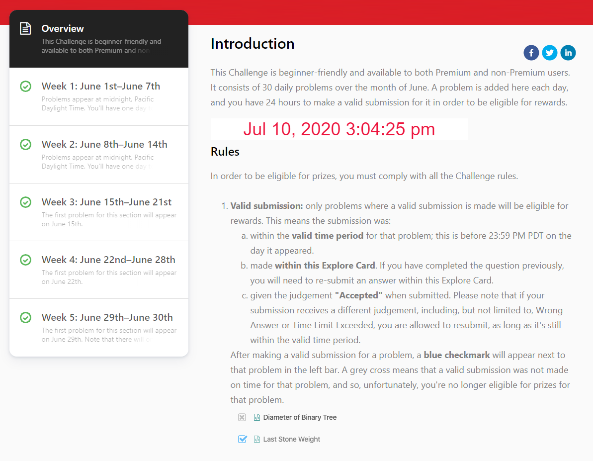

**WORK IN PROGRESS: DAYS 19, 21, 22**

This repo contains my work on the "June LeetCoding Challenge" which was released during the 2020 COVID-19 pandemic.

All submissions were made and accepted within the 24 hours of the release of each problem. For each problem, I have my own regular solution (or several), as well as my attempt to write the solution in one line, in as few characters as possible ('code golf').

All solutions were tested with my own custom test suite which requires no installations - everything can be run directly on Node. Initially, any examples within the problems constituted my tests. If I then failed any tests on LeetCode after submitting an attempted solution (or a code golf solution), I would subsequently include that test as well.

Many thanks to my friends and colleagues Thomas Luo [@tluo9713](https://github.com/tluo9713) and Alex Mok [@MistuhMok](https://github.com/MistuhMok) who often times had much more insightful and clever solutions than I did. Special thanks also to Manny Bugallo [@marvinody](https://github.com/marvinody) for his input in a few of my solutions.

UPDATE: LeetCode has released a "July LeetCoding Challenge"! Follow my progress here: https://github.com/stanley-c-so/leetcode-july-2020-challenge